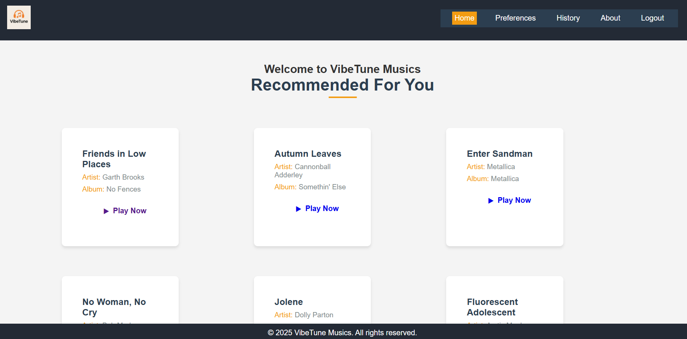
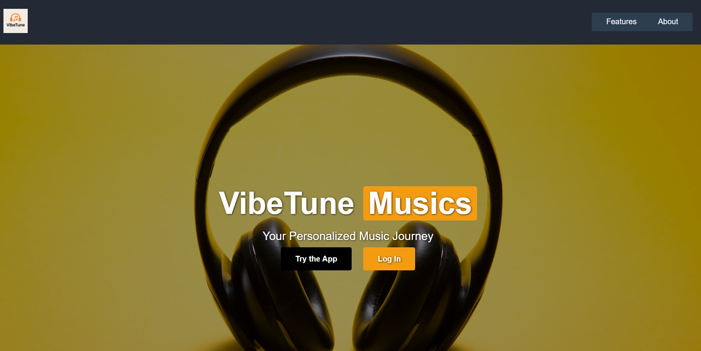
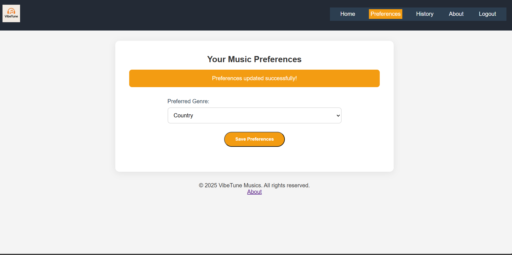
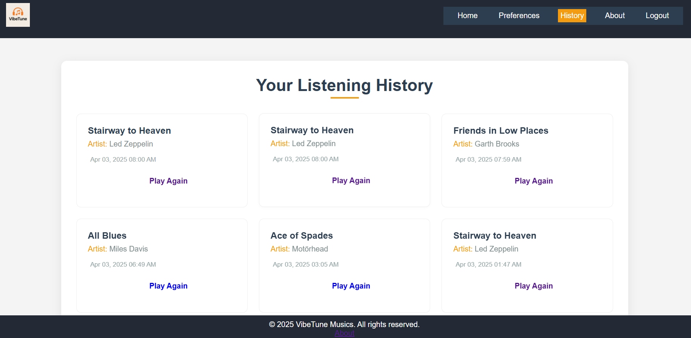
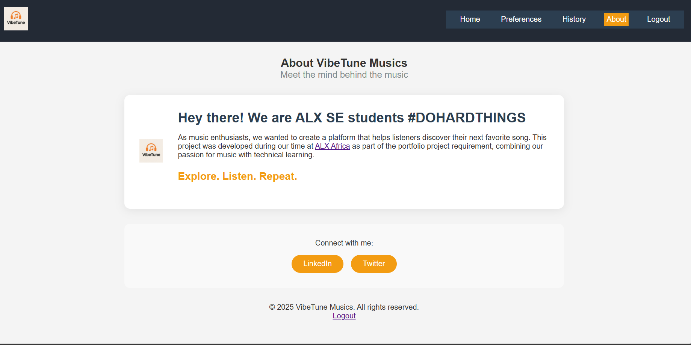

# VibeTune Musics - Flask Web Application

## Overview
VibeTune Musics is a Flask-based music recommendation system that provides users with personalized song recommendations. It integrates Google OAuth for authentication and stores music history to enhance user experience.

## Features
- User authentication (Google OAuth & manual login/signup)
- Dashboard displaying recommended music
- Playback history logging
- Secure session management
- PostgreSQL database integration

## Technologies Used
- **Backend:** Flask (Python)
- **Frontend:** HTML, CSS, JavaScript
- **Database:** PostgreSQL
- **Authentication:** Google OAuth 2.0

## Installation Steps
### 1. Clone the repository:
```bash
git clone https://github.com/yourusername/vibetune.git
cd vibetune
```
### 2. Create a virtual environment:
```bash
python3 -m venv venv
source venv/bin/activate  # On Windows use `venv\Scripts\activate`
```
### 3. Install dependencies:
```bash
pip install -r requirements.txt
```
### 4. Configure environment variables:
Create a `.env` file and add:
```env
FLASK_SECRET_KEY=your_secret_key
DATABASE_URL=your_postgresql_database_url
GOOGLE_CLIENT_ID=your_google_client_id
GOOGLE_CLIENT_SECRET=your_google_client_secret
```

### 5. Run the application:
```bash
flask run --host=0.0.0.0 --port=10000
```

## Deployment
To deploy on Render:
1. Push your project to GitHub.
2. Create a new Flask web service on Render.
3. Add environment variables in the Render dashboard.
4. Deploy and access the live app.

### Screenshots






# Common Errors I Did
- Forgot to `source venv` -> ModuleNotFound errors
- Wrong database URL format -> connection failures
- Google OAuth redirect URLs not matching -> login loops
- Forgetting to commit() after SQL changes -> lost data

## Future Ideas (If I Have Time)
- [ ] Better recommendations (using machine learning)
- [ ] Let users make playlists
- [ ] Add actual music playback
- [ ] Rating system for songs

## Contributions## How to Contribute
I'm new to open source! If you want to help:
1. Fork the repo
2. Make changes in a new branch
3. Send a pull request
Feel free to fork, improve, and submit pull requests.

## License
ALX SE Student

---
Happy Coding! 🎵
